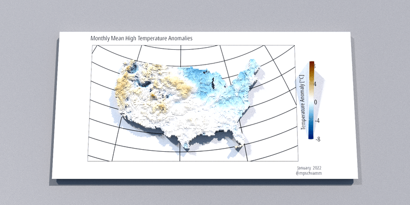

```{r setup, include=FALSE}
knitr::opts_chunk$set(echo = FALSE)
```

I wanted to make a little gif showing monthly temperature anomalies for the year using PRISM data and rayshader.

```{r eval=FALSE}
library(prism)
library(terra)
library(tidyverse)
library(tidyterra)
library(scico)
library(httr)
library(raster)
library(sf)
library(rayshader)
library(mpsTemplates)

# I use the mpsTemplates package to streamline my ggplot, just sub theme_minimal
# or similar.
```


```{r prismsetting, message=FALSE, warning=FALSE, include=FALSE, eval=FALSE}
data_path <- fs::path_wd("data")
prism::prism_set_dl_dir(data_path)

```


```{r script, eval=FALSE, code_folding=TRUE}
## download monthly normals
get_prism_normals(type = "tmax",
                  resolution = "4km",
                  mon = 1:7,
                  keepZip = FALSE)
## download monthly data
get_prism_monthlys(type = "tmax",
                   year = 2022,
                   mon = 1:7,
                   keepZip = FALSE)
## return the folders
tmean_norm_1 <- prism_archive_subset(type = "tmax",
                                     temp_period = "monthly normals",
                                     mon = 1:7,
                                     resolution = "4km")
tmean_1 <- prism_archive_subset(type = "tmax",
                                temp_period = "monthly",
                                mon = 1:7)
## right now some are provisional and some are stable, so I need to reorder the vector
tmean_1 <- tmean_1[order(c(2,3,4,5,6,7,1))]

## convert to terra
tmean_norm_1 <- pd_to_file(tmean_norm_1)
tmean_norm_1 <- rast(tmean_norm_1)

tmean_1 <- pd_to_file(tmean_1)
tmean_1 <- rast(tmean_1)

## change the layer names to something sensible
names(tmean_norm_1) <- month.name[1:7]
names(tmean_1) <- month.name[1:7]

tanomaly <- tmean_1 - tmean_norm_1

tanomaly <- project(tanomaly, "epsg:2163")


## create and extent polygon
prism_ext <- as.polygons(ext(tanomaly), crs=crs(tanomaly))
prism_ext <- st_as_sf(prism_ext)

## create a hexagon grid in the extent polygon
hexagons <- st_make_grid(prism_ext,
                         n = c(150,150),
                         square = FALSE,
                         crs = crs(prism_ext))

## convert from sf back to terra,
## we lose the crs def along the way
## so set the crs again
hexagons <- vect(hexagons)  
crs(hexagons) <- crs(tanomaly)

## calculate the mean raster values in each polygon
prism_summary_1 <- extract(x = tanomaly,
                         y = hexagons,
                         fun = mean,
                         na.rm = TRUE)


## extract returns a matrix, need to get the data back
## into hexagons 
values(hexagons) <- data.frame(ID = 1:nrow(hexagons))
hexagons <- merge(hexagons, data.frame(prism_summary_1))
values(hexagons) <- data.frame(prism_summary_1)


ggplot() + 
  geom_spatvector(data = hexagons, aes(fill = January), color = NA) +
  scale_fill_scico(name = "Temperature Anomaly [°C]", palette = "vik", 
                   na.value = "transparent", limits = c(-5, 5)) +
  guides(fill = guide_colorbar(title.position = "left",
                               barheight = 10)) +
  theme_mps_noto() +
  theme(legend.direction = "vertical",
        legend.position = "right",
        legend.title = element_text(angle = 90))


months <- month.name[1:7]
plots <- list()
for (i in 1:length(months)) {
  
  fill <- noquote(months[i])
  plots[[i]] <- ggplot() +
    geom_spatvector(data = hexagons, aes_string(fill = fill), color = NA) +
    scale_fill_scico(name = "Temperature Anomaly [°C]", palette = "vik",
                     na.value = "transparent", limits = c(-8, 8)) +
    guides(fill = guide_colorbar(title.position = "left",
                                 barheight = 10)) +
    labs(subtitle = "Monthly Mean High Temperature Anomalies",
         caption = paste(months[i], " 2022\n@mpschramm")) +
    theme_mps_noto() +
    theme(legend.direction = "vertical",
          legend.position = "right",
          legend.title = element_text(angle = 90),
          axis.text = element_blank(),
          axis.ticks = element_blank())
  
}


options(cores = 8)

for (i in 1:length(months)) {
      
  plot_gg(plots[[i]],
        width = 8,
        height = 4,
        solidcolor = "white",
        theta = 0,
        phi = 80,
        fov = 45,
        zoom = .5,
        background = "grey80",
        windowsize = c(1600, 800),
        max_error = 0.01)
  
  render_highquality(file = paste0("sp-rayshade-0", i, ".png"),
                   samples = 800,
                   sample_method = "sobol",
                   parallel = TRUE,
                   ground_material = rayrender::diffuse(color = "grey40",
                                                        sigma = 90),
                   environment_light = "dreifaltigkeitsberg_4k.hdr",
                   clamp_value = 5,
                   clear = TRUE)
  
}

library(gifski)

png_files <- sprintf("sp-rayshade-%s.png", c("01","02","03","04","05","06","07"))
gif_file <- gifski(png_files = png_files, width = 1600/2, height = 800/2, delay = 3)

```

```{r}

```

