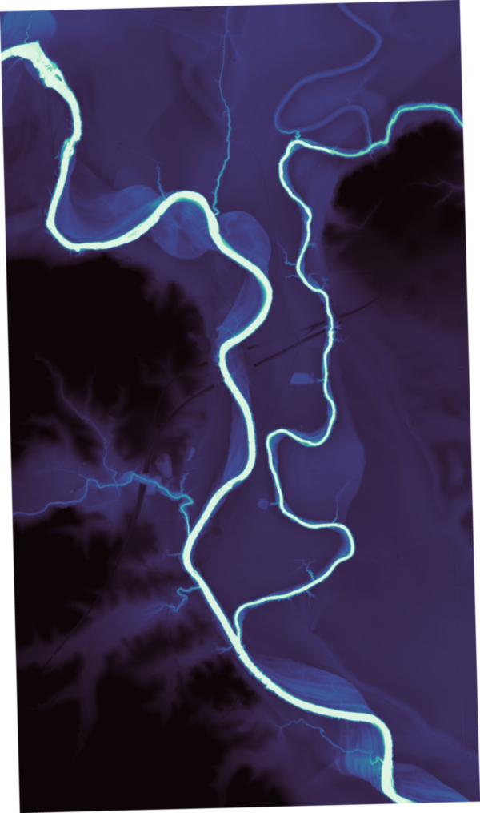
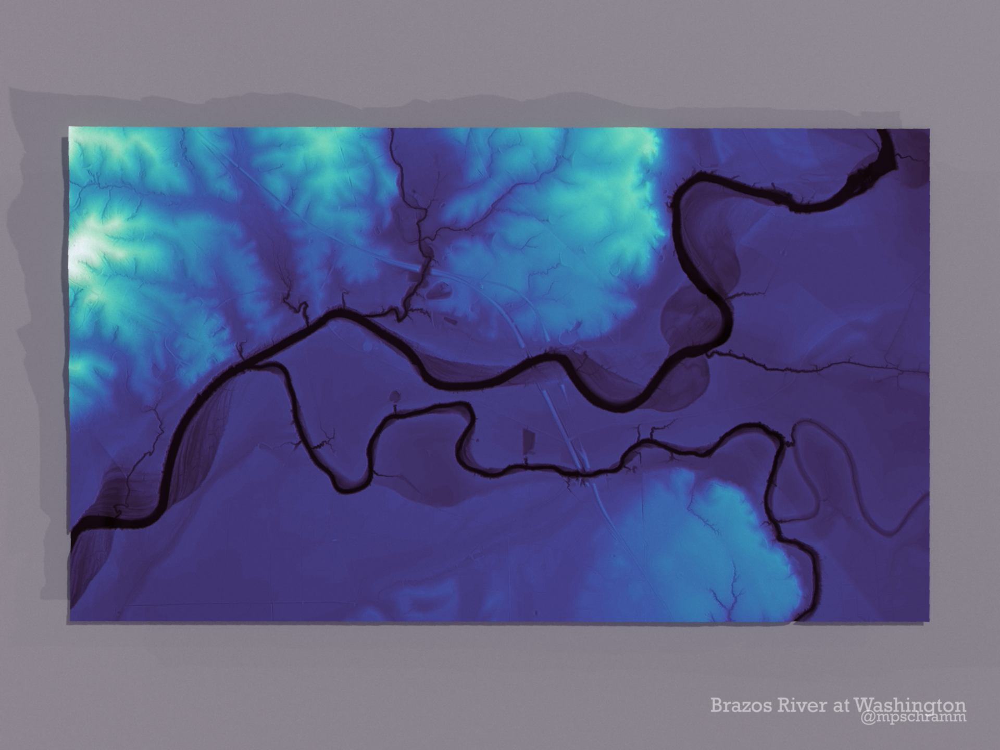

```{r setup, include=FALSE}
knitr::opts_chunk$set(echo = TRUE)
```

Daniel Coe has been making wonderful relative elevation maps of meandering rivers using LIDAR data for quite some time:

<blockquote class="twitter-tweet"><p lang="en" dir="ltr">60 river images in 60 seconds! Now all available in 4k resolution (3840x2160px) for non-commercial use—great for all your screen wallpaper needs. <a href="https://twitter.com/hashtag/lidar?src=hash&amp;ref_src=twsrc%5Etfw">#lidar</a> <a href="https://twitter.com/hashtag/geomorphology?src=hash&amp;ref_src=twsrc%5Etfw">#geomorphology</a> <a href="https://twitter.com/hashtag/geography?src=hash&amp;ref_src=twsrc%5Etfw">#geography</a> <a href="https://t.co/uaC94s2327">https://t.co/uaC94s2327</a> <a href="https://t.co/TFy2Ee1IQa">pic.twitter.com/TFy2Ee1IQa</a></p>&mdash; Daniel Coe (@geo_coe) <a href="https://twitter.com/geo_coe/status/1549953305110929408?ref_src=twsrc%5Etfw">July 21, 2022</a></blockquote> <script async src="https://platform.twitter.com/widgets.js" charset="utf-8"></script>


We even have a [print](https://society6.com/product/mississippi-delta-lidarfisk-comparison_print?sku=s6-18750172p4a1v45) hanging in our living room and I've been itching to try to make one myself using R. Recently, [OpenTopography](https://www.opentopography.org/) released the [RiverREM](https://opentopography.github.io/RiverREM/) package for Python which is kind of an easy mode button for produce a relative elevation model. I can use Python, I can use R. Now I just need to learn how to use LIDAR data...

## lidR

The [lidR](https://r-lidar.github.io/lidRbook/) has a host of functions for reading in lidar files or catalogs, creating digital terrain models, digital surface models, and a bunch of other stuff that is currently over my head! I primarily was interested in reading in the data, creating a high resolution digital terrain model, then getting it into RiverREM. The instruction manual linked above is a great resources and it took me about a day to become comfortable with reading in and manipulating data and making some really neat 3d maps. I'm actually excited about incorporating LIDAR into some of our hydrology and water quality projects now.


## Script

This example isn't going to be fully reproducible because (as far as I know) downloading LIDAR data requires point and click web interfaces for the most part, and I created polygons for clipping data in ArcGIS. 

```{r eval=FALSE}
library(lidR) # for lidar stuff
library(sf) # for vector spatial files
library(rayshader) # for fun 3d rendering
library(terra) # for raster data
library(reticulate) # need this to talk to python
library(viridis) # pretty colors
library(pracma) # for just one function, trust me
```


The general workflow is:

(1) read the LIDAR catalog (this does not load the entire LIDAR data into memory but keeps it on disk because of size)

(2) read in the polygon that has the area of interest

(3) clip the LIDAR data to the area of interest

(4) create the digital terrain model, which is the rasterized representation of the land and water surfaces in the LIDAR data.

(5) load the raster into riverREM and make a relative elevation model

(6) get the relative elevation model into rayshader and render it with desired colors and hillshading.

For reference, the LIDAR data was obtained from the [TNRIS web downloader tool](https://data.tnris.org/collection?c=b6ea8e3a-c8b7-4d97-b4d1-4eb8172eb87d#7.7/31.13/-96.5). I created a polygon in ArcGIS at the confluence of the [Brazos and Navasota rivers](https://www.google.com/maps/@30.3341313,-96.1474254,13z) for this example.

```{r eval=FALSE}
## Load/create the lidar catalog
brazos <- readLAScatalog("data/brazos/")

## this sets the temp files path and names used for files associated with this catalog
opt_output_files(brazos) <- paste0(tempdir(), "/{XCENTER}_{YCENTER}_{ID}")

## read the polygon shapefile of the area of interest
## and transform to the CRS used by the LIDAR data
conf <-st_read("data/navasota/confluence.shp") |> 
  st_transform(crs = 6343)

## clip polygon
conf_lidr <- clip_roi(brazos, conf)

## set path/filenames for conf_lidr so we don't
## overwrite brazos files
opt_output_files(conf_lidr) <- paste0(tempdir(), "/{*}_dtm")

## create the dtm, this might take a minute
terrain <- rasterize_terrain(conf_lidr, pkg = "terra")

## save the raster to a file
writeRaster(terrain, "confluence_raw_1.tif", overwrite = TRUE)
```

Now we have a high resolution digital terrain model raster created from the LIDAR data. This is basically a high res DEM that we can treat like any other raster data for spatial analysis. The next step is to get this into the RiverREM pacakage in Python. I'm not going into how to setup RStudio and Anaconda so you can use Python in RStudio. Plenty of tutorials and it varies slightly by OS. But RStudio has done a great job getting Python integrated into R workflows.

The RiverREM package loads the raster, looks up the hydrologic lines using the OpenStreeetMap API, points are sampled along the hydrologic feature and interpolated using inverse distance weighting across the elevation model, then the river elevation is detrended. More detailed info on the process is available on the [OpenTopography blog](https://opentopography.org/blog/new-package-automates-river-relative-elevation-model-rem-generation). 

```{r eval=FALSE}
## use the conda environment I have setup for this
use_condaenv("lidarpy")

## import riverrem
remmaker <- import("riverrem.REMMaker")

## initiate the REMmaker module
rem_maker <- remmaker$REMMaker(dem = "confluence_raw_1.tif", 
                               out_dir = "rem",
                               interp_pts = 10000, k = 100)

## create the REM
rem_maker$make_rem()

## you can create a hillshaded viz using riverREM
## if you want
rem_maker$make_rem_viz()
```


```{r echo=FALSE}

```


## rayshade

Ok, let's get this into rayshader to make it look a little (hopefully) nicer. I've cover this in previous posts, but the basic process is to read in raster data, convert to a matrix, then use the rayshader and rayrender packages to create raytraced shading effects.

```{r eval=FALSE}

## read in the raster data from riverREM
ras <- rast("rem/confluence_raw_1_REM.tif")

## trim the NA data around the edges
ras <- trim(ras)

## we are going to reduce the size of raster so I don't melt my laptop
ras <- terra::aggregate(ras, fact = 4)

## convert the raster to matrix
elmat <- raster_to_matrix(ras)
```

From here we can go straight to rayshader. But I wanted to adjust the viridis color palette to highlight differences at the elevation near the river. Basically, log transform the color palette without transforming the underlying data. I suspect there is a better way to do this, so pleas let me know!!!

```{r eval=FALSE}
## create a vector of log spaced values
n <- log10(pracma::logspace(0.0001, 1, n = 100))
## retrieve the colors based on values from the vector
fill <- colorRamp(colors = viridis::mako(100, direction = 1),
                  space = "Lab") (c(0, n))
fill <- rgb(fill, maxColorValue = 255)
```


Now we rayshade. I've been adapting my workflow and lifted a bunch of tips for making quality graphics using rayshder from [Spencer Schien's blog post](https://spencerschien.info/post/data_viz_how_to/high_quality_rayshader_visuals/). I highly recommend Spencer's Twitter feed as well for map eye candy.

```{r eval=FALSE}
# Dynamically set window height and width based on object size
w <- nrow(elmat)
h <- ncol(elmat)

# Scale the dimensions so we can use them as multipliers
wr <- w / max(c(w,h))
hr <- h / max(c(w,h))

# Limit ratio so that the shorter side is at least .75 of longer side
if (min(c(wr, hr)) < .75) {
  if (wr < .75) {
    wr <- .75
  } else {
    hr <- .75
  }
}

elmat |> 
  height_shade(texture = fill) |>  
  plot_3d(elmat,
          windowsize = c(850*hr,800*wr), 
          zscale = 2,
          solid = FALSE,
          theta = 91.5,
          phi = 90,
          fov = 45,
          zoom = 0.6,
          background = "grey80")
options( cores = 8)


render_highquality(file = "sp_confluence-0.png",
                   samples = 300,
                   sample_method = "sobol",
                   parallel = TRUE,
                   ground_material = rayrender::diffuse(color = "grey40",
                                                        sigma = 90),
                   environment_light = "rooftop_night_2k.hdr",
                   clamp_value = 5,
                   intensity_env = 1.5,
                   min_variance = 0.001,
                   clear = TRUE,
                   #tonemap = "uncharted",
                   progress = TRUE,
                   interactive = FALSE,
                   height = round(6000 * wr), 
                   width = round(6000 * hr))


library(magick)

# Read in image, save to `img` object
img <- image_read("sp_confluence-0.png")

# Title
img_ <- image_annotate(img, "Brazos River at Washington", font = "Rockwell",
                       color = alpha("white", 0.5), size = 125, gravity = "southeast",
                       location = "+200+200") |> 
  image_annotate("@mpschramm", font = "Rockwell", color = alpha("white", 0.5),
                 size = 95, gravity = "southeast",
                 location = "+200+150")

img_

image_write(img_, "sp_confluence_annotate.png")
```

```{r echo=FALSE, layout="l-screen-inset shaded", preview=TRUE}

```

